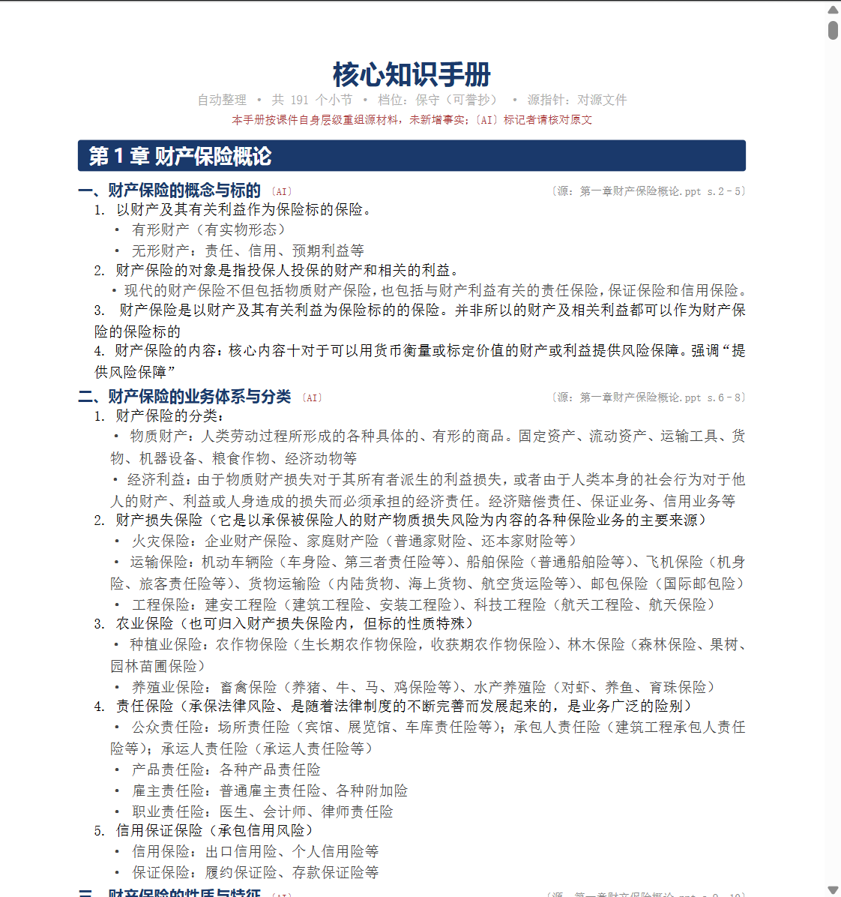
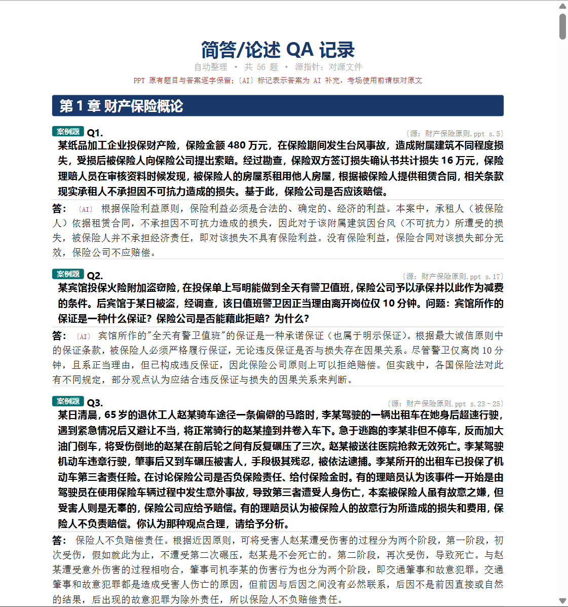
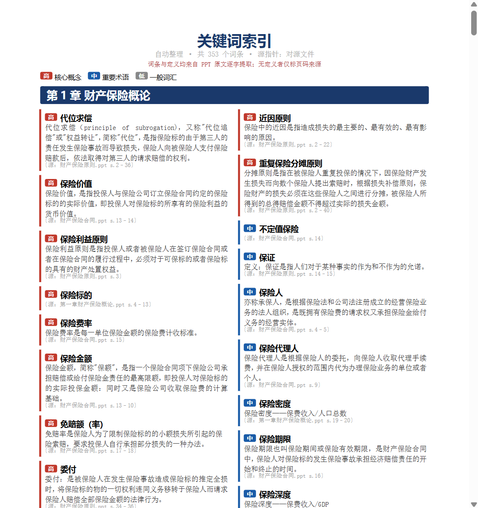
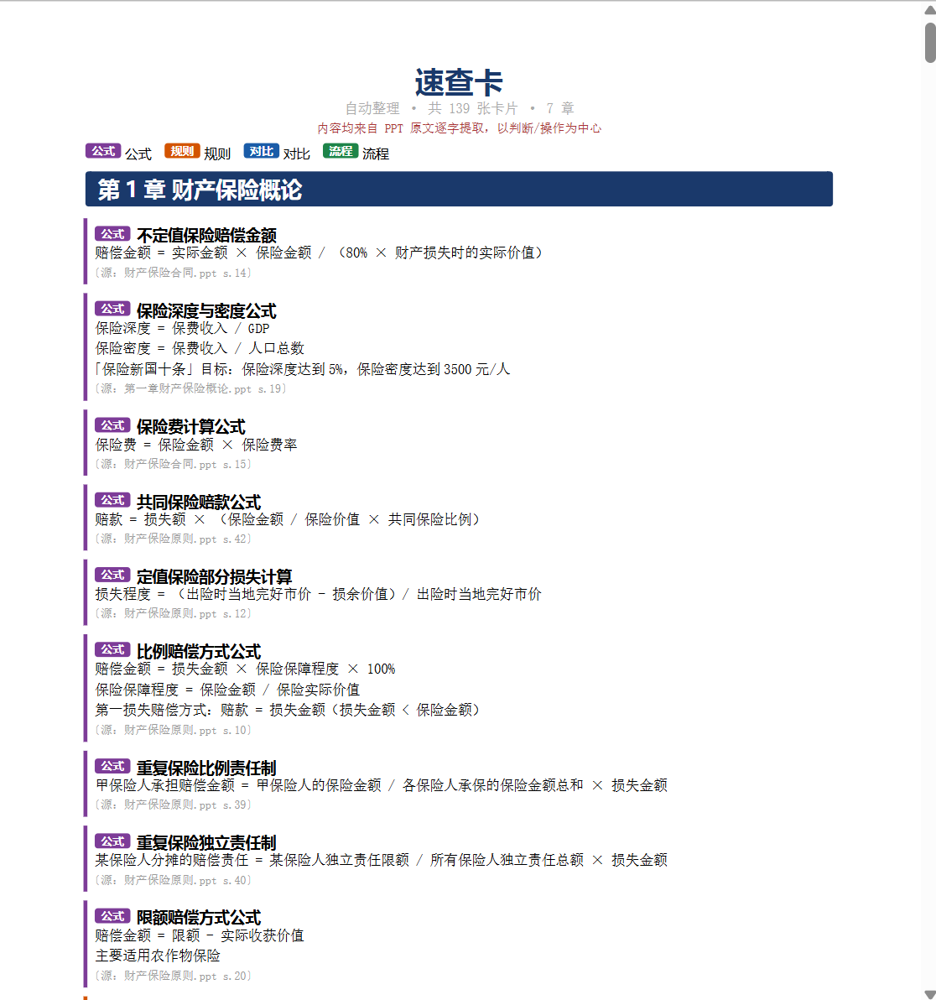
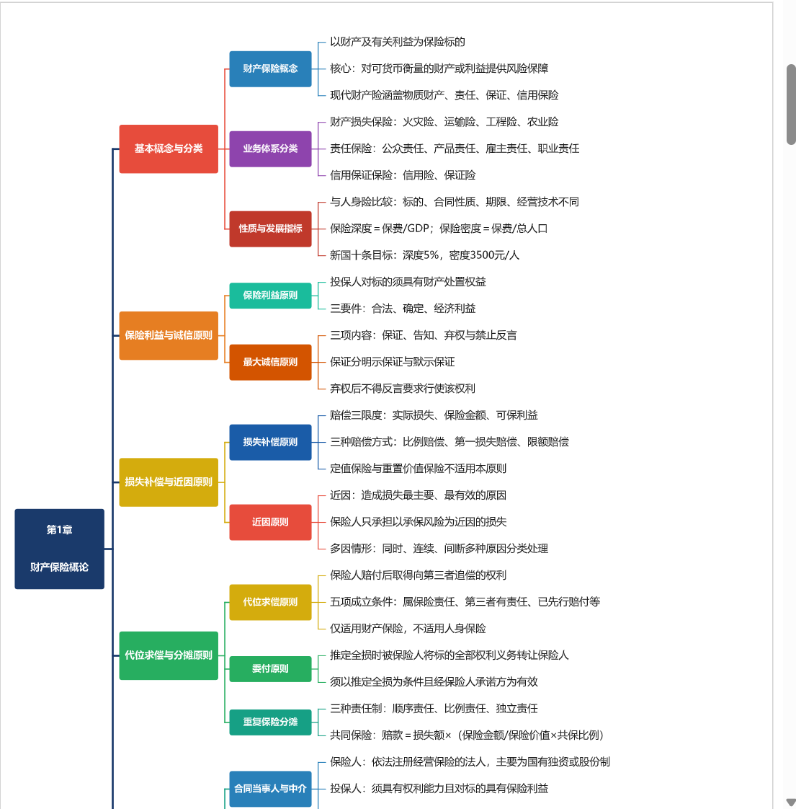

# 开卷考课件整理 Skill

> **把一学期的课件 PPT，变成考场上真正能用的打印件——每条知识点都知道自己在你手里那叠纸的第几页。**

零代码。不用懂命令行。把课件丢进一个文件夹，对 Claude 说一句话，回来取 PDF。

<!-- 🎬 演示 GIF 占位（Hiean 后补）：录一段「丢文件夹 → 说一句话 → 取 PDF」的操作，
     放 docs/images/demo.gif，再取消下面这行注释： -->
<!--  -->

---

## 这是什么

这是一个开卷考课件整理 Skill，给它一个装满课件的文件夹，按需产出最多 **6 种**可打印 PDF（每种都可单独勾选）：

| 产物 | 一句话用途 |
|---|---|
| 📄 **L0 · 清洗版全集** | 删掉封面/过场等废页，加章节书签，每页盖来源戳——就是你的"原件打印版" |
| 📘 **L1 · 核心知识手册** | 按章整理的可誊抄条目，内嵌原图（省得手画 ER 图），每节标来源页码 |
| 📋 **QA · 简答库** | PPT 里出现过的简答/论述/案例题，原题原答逐字整理；只有题没答案时 AI 补充并标 〔AI〕 |
| 🔑 **L2 · 关键词索引** | 按章整理的专业术语，标高/中/低频，附 PPT 原文定义与页码 |
| ⚡ **C · 速查卡** | 规则 / 条件 / 流程 / 公式，以"怎么判断、怎么操作"为中心，附来源指针 |
| 🗺️ **M · 思维导图** | 一页全局总览 + 逐章树形导图（XMind 式：根在左、分支居中、叶在右），快速建立知识脉络 |

六种产物长这样（点开看大图）：

<table>
  <tr>
    <td align="center"><br><sub><b>清洗版PPT全集</b></sub></td>
    <td align="center"><br><sub><b>核心知识手册</b></sub></td>
    <td align="center"><br><sub><b>简答库</b></sub></td>
  </tr>
  <tr>
    <td align="center"><br><sub><b>关键词索引</b></sub></td>
    <td align="center"><br><sub><b>速查卡</b></sub></td>
    <td align="center"><br><sub><b>思维导图</b></sub></td>
  </tr>
</table>

---

## 为什么不直接用豆包 / DeepSeek？

**因为长PDF的总结内容不保真，幻觉严重，输出的文档格式乱，还需要逐章输入PDF。**

| 场景 | 豆包 / DeepSeek | 本 Skill |
|---|---|---|
| 一学期 11 个 PPT、近千张幻灯片 | 经常卡死、截断，只读了前半 | 全量处理，每页都不漏 |
| "这个知识点在我打印件第几页？" | 不知道，瞎蒙 | 精确到页，每条都标来源 |
| 对话窗口一关 | 内容消失，下次重喂 | 落地成 PDF，永久保存、可打印 |
| AI "贴心地"补了课件没有的内容 | 很常见——考场写上去反而扣分 | 只重组原文，0 字臆造；AI 补的一律标 〔AI〕 |
| 最终交付物 | 聊天框里一段文字 | 带章节书签、可直接打印的 PDF |

---

## 快速上手

### 你需要先有

- **[Claude Code](https://claude.ai/code)** , 可见我的[安装配置教程](https://github.com/PaikyHiean/Server-Configuration-Claude-Code)
- Windows / macOS / Linux 都支持

### 第一次安装

**第 1 步：下载本仓库**

```bash
git clone https://github.com/PaikyHiean/opencram-skill.git
```

> 不会用 git？直接点本页面右上角 **Code → Download ZIP**，解压即可。

**第 2 步：复制到 Claude Code 的 skills 目录**

命令行如下，也可手动复制粘贴。

Windows（PowerShell）：
```powershell
Copy-Item -Recurse ".\opencram-skill" "$env:USERPROFILE\.claude\skills\open-book-exam-courseware"
```

macOS / Linux：
```bash
cp -r ./opencram-skill ~/.claude/skills/open-book-exam-courseware
```

**第 3 步：放课件、说一句话**

把课件 PPT 全放进一个文件夹（如 `D:\期末复习\财产保险`），然后在 Claude Code 里说：
```
帮我整理 D:\期末复习\财产保险 里的开卷考课件
```
它会用 opencram-skill 一步步引导你。

### 其余依赖（它会自动帮你装）

排版和转换需要 LibreOffice、Typst 和几个 Python 库。第一次运行时它会**先体检、征求你同意再装**：

- **Windows**：全自动（用 `winget` 装 LibreOffice + Typst，`pip` 装 Python 库）
- **macOS / Linux**：Python 库自动装；LibreOffice / Typst 会打印对应的 `brew` / `apt` / `snap` 命令，你复制执行一下即可

> 💡 首次安装主要在下 LibreOffice（用于转换PPT格式与提取文本内容），体积较大、需要几分钟（具体取决于网速）；之后每次都是秒过。

---

## opencram-skill会如何进行？

你只需要感知到这 5 个环节，其余都在后台自动跑：

```
 📁 给文件夹路径
     │
     ▼
 🗂️ 确认章节结构 ──→ 你可以合并/拆分/重命名，把没章号的文件归位
     │
     ▼
 ☑️ 勾选要哪几种 PDF + 《核心知识手册》的精简力度（默认：保守·可誊抄）
     │
     ▼
 ⏳ 等几分钟（首次装工具约几分钟，之后秒过）
     │
     ▼
 📦 去 outputs/ 取件
```

> 完整的内部编排（抽取 → 页码映射 → 逐章 AI agent 蒸馏 → 渲染 → agent 复核，共 11 个 Phase）
> 写在 [`SKILL.md`](SKILL.md) 里，你可以点开下面看全貌。

<details>
<summary><b>🔧 展开：完整内部流程（Phase 0–11）</b></summary>

```
 📁 课件文件夹
     │
     ▼
 Phase 0   盘点 ···················· inventory.py
     │
     ▼
 Phase 1   章节识别  ✋ 需你确认 ····· detect_chapters.py
     │
     ▼
 Phase 2   勾选产物 + 精简档  ✋ 需你确认 ·· config.json
     │
     ▼
 Phase 3   依赖体检 / 安装 ·········· doctor.py --install
     │
     ▼
 Phase 4   抽取文字·表·图 + 建页码映射 ·· extract.py
     │
     ▼
 Phase 5   L0 清洗版全集 ············ build_l0.py → L0.pdf
     │
     ▼
 Phase 6–10   五种知识产物（各派一队子 agent，见下方「AI 小队」）
     │         L1 核心知识手册 · QA 简答库 · L2 关键词索引
     │         C 速查卡 · M 思维导图（以 L1 蒸馏结果为源）
     │
     ▼
 Phase 11   复核 agent ············· 防臆造体检，列出待核清单
     │
     ▼
 📦 outputs/ 取件
```

</details>

---

## 🤝 背后是一支分工明确的 AI 小队

知识产物（L1/QA/L2/C/M）不是一个大模型一口气硬读完所有课件——那样必然截断、幻觉。
这里用的是**主控 + 多个专职子 agent 协作**：主控只调度、不读原文；每个子 agent 只领**一章**，
互相隔离、可并行，谁也塞不爆上下文，不必有**token 焦虑**。

```
                  主控 Orchestrator（Claude）
                  └ 只读简报 / JSON，绝不把课件原文读进上下文
                              │
                  按「单章」并行派发 Task 子 agent
                              │
        ┌────────┬────────┬────────┬────────┐
       章节1    章节2     章节3    ...      章节N      每个 agent 只领一章，
        │        │        │                 │        上下文互相隔离
        └────────┴────────┴────────┴────────┘
                              │  各章各自产出 out_<k>.json
                              ▼
            merge_*.py   确定性合并（加编号 · 源指针 · 图片路径）
                              ▼
              render.py → PDF（L1/QA/L2/C 走 Typst，M 走 matplotlib）
```

按产物派发不同「工种」的子 agent，各司其职（角色定义都在 [`agents/`](agents/) 下）：

- 🧪 **蒸馏 agent** — L1：语义去重、压缩、补小节标题，**正文仍逐字**不改写
- 🖼️ **图片筛查 agent** — L1：逐张判断配图去留（流程图/ER 图留下，装饰图删掉）
- ❓ **抽题 agent** — QA：只收 PPT 里真出现过的题；有题无答才补答，并标 〔AI〕
- 🔑 **抽词 agent** — L2：抽专业术语 + 高/中/低频分级 + 原文定义
- ⚡ **速查 agent** — C：抽规则 / 流程 / 公式 / 对比表
- 🗺️ **导图 agent** — M：每章一个按主题归并分支，再加 1 个**全局总览 agent** 汇总
- 🛡️ **复核 agent** — 交付前防臆造体检，列出待核清单（只提示、**不改产物**）

> **为什么这样设计能信？** 编号与源指针（页码）全程由脚本**确定性**生成，AI 子 agent 只碰文字内容、
> 从不经手页码——所以 AI 再聪明也动不了你的溯源链，页码永不漂移。

---

## 《核心知识手册》精简力度，三档可选

同一份课件，你想要"能整段背"还是"只要骨架定位"，自己定：

| 档位 | 体积 | 特点 | 适合 |
|---|---|---|---|
| **保守**（默认） | 原文 80–90% | 论证链完整，可直接誊抄 | 需要背完整段落的科目 |
| **标准** | 原文 40–50% | 要点化，压缩举例 | 大多数文科科目 |
| **骨架** | 原文 15–20% | 只留核心论断 | 仅作为考场定位工具 |

举个例子，同一个知识点在三档下的样子：

> **保守**：保险利益原则要求投保人对保险标的具有法律上承认的利益，且该利益须为合法利益、确定利益、可用货币计量的经济利益。其立法目的在于防止赌博行为、防止道德风险、限制损失补偿。
>
> **标准**：保险利益原则——投保人须对标的有合法、确定、可货币计量的利益。目的：防赌博、防道德风险、限补偿。
>
> **骨架**：保险利益原则 = 合法 + 确定 + 可计量；防赌博/道德风险/限补偿。

实践是检验真理的唯一标准——拿不准用哪档，就先跑默认的"保守"，不够再说。

---

## 示例数据

下面是用一份**真实的《财产保险》课件**跑出来的规模，供你判断它能干到什么程度：

```
输入：11 个 .ppt 文件，978 张幻灯片 → 自动识别为 7 章

✅ 清洗版PPT全集.pdf   973 页 · 36 MB   （删掉 5 张废页，含章节书签 + 来源戳）
✅ 核心知识手册.pdf     61 页 · 2 MB    （191 个小节 / 761 条知识点 / 内嵌 7 张原图）
✅ 简答库.pdf          17 页           （56 道题，原题原答 + AI 补答标注）
✅ 关键词索引.pdf      15 页           （353 个词条，含频率分级与页码来源）
✅ 速查卡.pdf          18 页           （139 张卡片：公式/规则/对比/流程）
✅ 思维导图.pdf         8 页           （全局总览 + 逐章树形导图，35 主分支 / 103 子分支 / 292 节点）
```

> 这是**一份真实课件**的实测结果，换你自己的课件，规模会不同。

---

## 一段真实对话长什么样

```
你：帮我整理 D:\期末复习\财产保险 里的开卷考课件

Claude：扫描完毕。发现 11 个 .ppt 文件，共 978 张幻灯片。
        推断出的章节结构如下，请确认：

          第1章  财产保险概论（3 个文件合并）
          第3章  人身保险合同
          第4章  人寿保险
          第6章  企业财产保险（3 个文件合并）
          第7章  家庭财产保险
          第9章  机动车辆保险
          第14章 责任保险

你：没问题，就这样分

Claude：好。你要生成哪几种 PDF？默认帮你勾了 L0 + L1，
        精简力度用默认的"保守·可誊抄"行吗？

你：6 种都要，精简力度用默认的

Claude：好，开始处理。检测到缺 LibreOffice，安装吗？（约几分钟）

你：装

Claude：✅ 全部完成，产物在 outputs/ 文件夹：
        清洗版PPT全集.pdf（973 页）
        核心知识手册.pdf（61 页）
        简答库.pdf（17 页）
        关键词索引.pdf（15 页）
        速查卡.pdf（18 页）
        思维导图.pdf（8 页）
```

---

## 关于"可溯源"优势

产出的《核心知识手册》里每个小节标题旁，都有一个灰色的来源指针，比如：

> **一、财产保险的概念与标的** 〔源：第一章财产保险概论.ppt s.2–5〕

`s.2–5` 的意思是：**这段内容来自那个 PPT 文件的第 2–5 张幻灯片。**

考场上遇到拿不准的题，你就知道该翻自己打印件的哪一页去核对原文——而不是赌 AI 有没有编。

> 如果你勾选了 L0（清洗版PPT全集），指针会自动换算成 L0 里的实际页码。

---

## 信任承诺

三句话讲清楚它凭什么可信：

1. **0 字臆造** —— 所有正文都从 PPT 原文提取，只做归并、去重、重组，不改写、不补全。
2. **全程可溯源** —— 每条知识点都挂一个 `(源文件名, 第几张幻灯片)` 锚点，清洗规则变了也不漂移。
3. **AI 生成必标注** —— 任何由 AI 补写的内容（如有题无答时的补答、语义归并后的小节）一律以红色 `〔AI〕` 标出，提醒你回原文核对。

技术上：文字用 [python-pptx](https://python-pptx.readthedocs.io/) / [pypdf](https://pypdf.readthedocs.io/) 抽取，L1/QA/L2/C 用单文件二进制的 [Typst](https://typst.app/) 排版（不用装 LaTeX），M 思维导图用 matplotlib 画树形图，图片直接从 PPT 内嵌数据抠出。详细编排见 [`SKILL.md`](SKILL.md)，排版参数见 [`templates/TYPOGRAPHY.md`](templates/TYPOGRAPHY.md)。

---

## 限制与已知边界

它**不能**做什么：

- **不做 OCR**：如果某个 PPT 是扫描件（图片转的，没有文字层），它抽不出文字。这类文件会进 L0（保留原页），但不会出现在 L1/L2/C/QA/M 里。
- **复杂动画 / 特效保真一般**：L0 靠 LibreOffice 把 PPT 转 PDF，遇到花哨的逐帧动画、嵌入视频、特殊字体时，版式可能和原版略有出入。
- **中文字体要就位**：系统里得有一款中文字体（Windows 自带的微软雅黑/黑体即可），否则转出来的 PDF 会是方块——体检脚本会提前告诉你。
- **AI 蒸馏需要在对话里派发**：L1/L2/C/QA/M 的语义增强由 Claude 在对话中按章派发子 agent 完成；没派发的章会回退到"纯机械抽取"的基线版（仍可用，只是不做语义归并）。

---

## 文件结构

```
opencram-skill/
├── README.md              ← 你正在看的这个
├── SKILL.md               ← 给 Claude 看的完整编排说明（11 个 Phase 的细节）
├── scripts/               ← 所有干活的 Python 脚本（你不用手动跑）
│   ├── inventory.py           盘点文件夹
│   ├── detect_chapters.py     推断章节结构
│   ├── doctor.py              依赖体检 / 自动安装（--install）
│   ├── extract.py             抽取每页文字/表/图 + 建页码映射
│   ├── build_l0.py            生成 L0 清洗版全集（清洗版PPT全集.pdf）
│   ├── distill_l1.py          L1 确定性基线
│   ├── prep_*.py / merge_*.py 各产物的"切输入包 / 合并结果"
│   ├── render.py              L1/QA/L2/C 用 Typst 渲染出 PDF
│   ├── render_m.py            M 思维导图用 matplotlib 渲染（树形布局）
│   └── ...
├── templates/             ← Typst 排版模板（l1/l2/c/qa.typ）+ 排版参数说明
├── agents/                ← 各 AI 子 agent 的角色说明（蒸馏/抽题/抽词/速查/导图…）
├── work/                  ← 运行时中间产物（自动生成，已 gitignore）
└── outputs/               ← 最终 PDF 落地处（自动生成，已 gitignore）
```

> `work/`、`outputs/`、课件文件夹是运行时数据，**不随仓库分发**。仓库里只有
> `SKILL.md scripts/ templates/ agents/` 这套"引擎"。

---

## 常见问题排查

<details>
<summary><b>❌ 提示 LibreOffice 转换失败 / 找不到 <code>soffice</code></b></summary>

**原因**：LibreOffice 没装，或装在了含中文/空格的路径里。

**解决**：
1. 运行 `python scripts/doctor.py`，看 `LibreOffice` 一行是否为 ✅。
2. 仍失败，就在 `work/config.json` 里手填绝对路径：
   ```json
   { "soffice_path": "C:/Program Files/LibreOffice/program/soffice.exe" }
   ```
3. Windows 建议保持默认安装路径，别改到含中文或空格的目录。
</details>

<details>
<summary><b>❌ Typst 渲染失败 / 中文变方块</b></summary>

**原因**：Typst 找不到 `work/config.json` 里指定的中文字体名。

**解决**：
1. 运行 `python scripts/doctor.py`，看 `中文字体` 一行命中了哪些字体名。
2. 把 `work/config.json` 的 `cjk_font` 改成命中列表里的某个名字（常见：`Microsoft YaHei`、`SimHei`、`Noto Sans CJK SC`）：
   ```json
   { "cjk_font": "Microsoft YaHei" }
   ```
3. 重新运行 `python scripts/render.py l1`（或对应产物）。
</details>

<details>
<summary><b>⚠️ 某个 PPT 抽不出文字 / 该章在 L1 里是空的</b></summary>

**原因**：那个 PPT 多半是**扫描件**（图片转的 PPT），没有文字层。本 skill 不做 OCR。

**解决**：
- 运行 `python scripts/doctor.py` 或看 `work/manifest.json`，标了疑似无文字层的就是它。
- 这类文件仍会进 L0（保留原页），但 L1/L2/C/QA/M 没有对应内容。
- 有文字版 PPT 就换文字版重跑；或手动把关键内容粘进一个新 PPT 再处理。
</details>

<details>
<summary><b>⚠️ L1 某些章节没有 AI 增强，像是"机械抽取"</b></summary>

**原因**：AI 语义增强需要 Claude 在对话里**显式派发子 agent**。没派发的章会回退到确定性基线版。

**解决**：在对话里告诉 Claude「帮我对第 k 章运行 AI 蒸馏」，它会按 `agents/distillation.md` 派发；完成后会自动合并，缺的章用基线兜底。
</details>

---

## 参与贡献 / 反馈

发现 bug、想要新产物、或某些课件处理出错？欢迎提 Issue 或 Pull Request。

如果它帮你考场上少翻了几次书，给个 ⭐ 就是最好的反馈。

---

## License

[MIT](LICENSE) © 2026 PaikyHiean — 可自由使用、修改、分发，附带版权声明即可。
